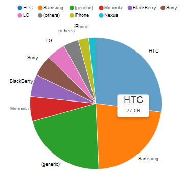

# mobile-usage

Analyze HTTP access logs and visualize statistics w/ focus on mobile usage.

This project consists of two parts:

  * analyze log files and aggregate mobile usage information to a JSON object.
  * visualize one of those JSON objects with charts and tables.

You get information about

  * devices - mobile, tablet, desktop, tv, game console, ...
  * operating systems and versions
  * browser and versions
  * Mobile Grade (A, B, C)

## Example Output

See an example output at <http://hgoebl.github.io/mobile-usage/>. Do not believe the numbers - the statistic
is generated using the test-data of [mobile-detect.js](https://github.com/hgoebl/mobile-detect.js/), so it is
only reflecting User-Agents covered by the test. It has absolutely nothing to do with reality.



## tl;dr

There are many very good HTTP-log analyzers like <a href="http://awstats.sourceforge.net">AWstats</a>,
<a href="http://www.webalizer.org/">The Webalizer</a> or <a href="http://www.analog.cx/">Analog</a>,
just to name a few.<br>
<a href="https://github.com/hgoebl/mobile-usage/">mobile-usage</a> is not a full-blown log analyzer, just
a supplement to existing ones with a special focus on mobile devices.
It should give you answers to questions like:
<ul>
    <li>How many visitors come to my site using phones or tablets?</li>
    <li>Which mobile devices are used?</li>
    <li>Which mobile operating systems and versions are used?</li>
</ul>
This statistic is based on a piece of information provided by browsers requesting web resources
like HTML-pages and images. Web-Browsers and search engines usually send an HTTP-Header called
<b>User-Agent</b>. With the help of <a href="http://mobiledetect.net/">Mobile-Detect</a>, devices
are detected by the User-Agent header.

# Requirements

As input this component needs a log-file, typically written by a web-server like Apache, which logs the
HTTP-Header 'User-Agent'.

# Installation

    $ npm install [-g] mobile-usage

# Usage

```
Usage: mobile-usage [options]

Options:
  --encoding, -e  character-set of input                            [default: "utf8"]
  --input, -i     path/name of the input-file (stdin if not set)    [default: null]
  --output, -o    path/name of the output-file (stdout if not set)  [default: null]
  --config        path/name of configuration file (js)              [default: null]
  --header        header text, e.g. site-name, server-name, ...     [default: null]
  --help, -h      show help and exit
```

## Examples

    $ mobile-usage --input test/data/pseudo-access.log.txt \
                   --output web/pseudo-data/example-summary.json \
                   --header 'mobile-detect UAs'

    $ grep 'GET / HTTP' access.log | mobile-usage > summary-index.json

## Configuration

You can provide a configuration object containing your implementations of `analyze`, `filterRaw`, `transform`,
`filterCooked`, `map`, `reduce`. Most often one will only provide a custom `analyze` function (if log-file is
not in Apache httpd combined format), probably a `filterRaw` function for eliminating unwanted request types
and sometimes a `filterCooked` method to drop hits of irrelevant device types, e.g. Bots.

Have a look at the example at `./config-example.js`.

As you can imagine, it is possible to analyze arbitrary text-files (csv, ...) and filter, transform, map, ... in
any form you like.

# License

MIT-License (see LICENSE file).

# Steps

Following steps are taken while creating statistics. Each of these steps can be configured or re-programmed.
The program consumes a source (stdin or a text-file with line-endings) and emits 'line' events. Each line
goes through the steps, gets analyzed, transformed, filtered, mapped and reduced. At the end, we have an
aggregated summary which can be visualized by the web page.

## Extraction (analyze)

The first step consumes some kind of source, typically a log-file written by a web-server (access_log).
As a result the process emits JSON-Objects like `{ userAgent: 'Mozilla/5.0 ...', count: 1, ... }`.

By default a log line of a 'combined' Apache httpd access-log is assumed (see ./lib/LogLineAnalyzerApache.js).

## Raw Filtering (filterRaw)

Each analyzed JSON-Object is passed to a filter which can decide to skip this record (e.g. traffic from internal
network, hits produced by images, ...).

By default no raw filtering is made, so all valid log-lines will be passed to the next step.

## Transformation (transform)

In this step we interpret the raw hit object and transform it to information. In our case we take the User-Agent
header and let `mobile-detect` extract information about the device.

The standard implementation creates an object like this:

    {
        os: md.os(),
        phone: md.phone(),
        tablet: md.tablet(),
        mobileGrade: md.mobile() && md.mobileGrade(),
        mobileGradeAll: md.mobileGrade(),
        userAgent: md.userAgent(),
        formfactor: formfactor,
        desktopBrowser: desktopBrowser,
        versions: versions
    }


## Cooked Filtering (filterCooked)

Here we have the next possibility to filter out unwanted hits based on the "cooked" information object.
You get a cooked object in (created by `transform`) and can decide whether it should be considered in the
summary by returning a truthy value.


## Map

In this step the cooked objects from `transform` are prepared to better suite as statistical input. You can think
of this aggregated object as "tiny summaries".

## Reduce

The last step takes arrays of the mapped objects of the previous step and reduces them to single objects where
sums, counts, averages and the like are built.

## Store Result

After reducing all statistical data these results are printed to `stdout` or saved to a file.

## Show Statistics

There is a front-end written in HTML which visualizes the statistical data and provides navigation over time.
It works only on modern browsers and even denies MSIE <= 10 because I don't want to spend 50% of my time fixing
special IE bugs.

# Credits

For visualizing statistics following components are used:

  * [D3.js - Data-Driven Documents](http://d3js.org/)
  * [NVD3 Re-usable charts for d3.js](http://nvd3.org/)
  * [Twitter Bootstrap 3](http://getbootstrap.com/)

Special thanks to the guys who created and open-sourced this awesome work! This is of course as well true for the
"invisible" guys (node.js, V8, GNU, ...).

# Contributing

Your contribution is welcome.

  * fork hgoebl/mobile-usage
  * run `npm install`
  * create branch
  * make changes and run `npm test` (**TODO** not available yet)
  * commit, push to your branch
  * create pull request

## Testing

**TODO**

# TODO

  * improve documentation
  * generate gh-pages (better than `cp -r web/* ../mobile-usage@gh-pages/`
  * add Gruntfile (jshint, gh-pages, uglify)
  * CLI for static server (web)
  * add tests, at least for summary-generation
